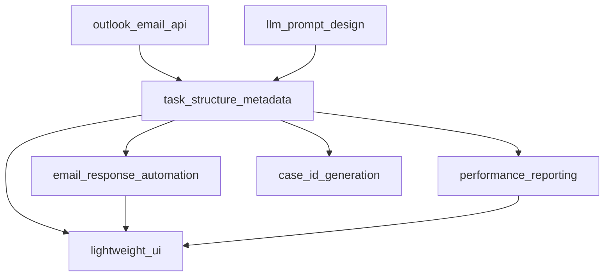

# HandyConnect Features Overview

This directory contains all functional components organized by feature area. Each feature is designed to be modular, independently developable, and can be built progressively.

## 🏗️ Feature Architecture

```
features/
├── __init__.py                    # Feature registry and utilities
├── README.md                      # This overview document
├── outlook_email_api/             # Microsoft Graph API integration
├── llm_prompt_design/             # Prompt engineering and evaluation
├── task_structure_metadata/       # Task schema and metadata
├── email_response_automation/     # Automated email responses
├── lightweight_ui/               # Performance-optimized UI
├── performance_reporting/         # Analytics and reporting
└── case_id_generation/           # Unique ID generation
```

## 📋 Feature Development Status

| Feature | Priority | Status | Description |
|---------|----------|--------|-------------|
| **outlook_email_api** | High | Planned | Microsoft Graph API integration for Outlook emails |
| **llm_prompt_design** | High | Planned | Prompt engineering and evaluation framework |
| **task_structure_metadata** | High | Planned | Task schema and metadata management |
| **email_response_automation** | Medium | Planned | Automated email response system |
| **lightweight_ui** | Medium | Planned | Performance-optimized UI components |
| **performance_reporting** | Low | Planned | Analytics and reporting capabilities |
| **case_id_generation** | Low | Planned | Unique case ID generation strategies |

## 🚀 Development Approach

### Phase 1: Core Foundation (High Priority)
1. **outlook_email_api** - Email integration and polling
2. **llm_prompt_design** - AI processing and classification
3. **task_structure_metadata** - Data models and validation

### Phase 2: Enhanced Functionality (Medium Priority)
4. **email_response_automation** - Automated responses
5. **lightweight_ui** - Improved user experience

### Phase 3: Advanced Features (Low Priority)
6. **performance_reporting** - Analytics and insights
7. **case_id_generation** - Advanced ID management

## 🔧 Feature Development Guidelines

### Module Structure
Each feature module should follow this structure:
```
feature_name/
├── __init__.py           # Module exports and initialization
├── README.md            # Feature-specific documentation
├── core/               # Core functionality
├── utils/              # Utility functions
├── tests/              # Unit and integration tests
├── config/             # Configuration files
└── examples/           # Usage examples
```

### Development Standards
- **Modularity**: Each feature should be independently testable
- **Documentation**: Comprehensive README and code documentation
- **Testing**: Unit tests for all major components
- **Configuration**: Environment-based configuration
- **Error Handling**: Robust error handling and logging
- **Performance**: Optimized for production use

### Integration Points
- Features should integrate through well-defined APIs
- Use dependency injection for loose coupling
- Implement feature flags for gradual rollout
- Maintain backward compatibility during updates

## 📊 Feature Dependencies



## 🎯 Success Metrics

Each feature should define and track:
- **Functionality**: Core feature completeness
- **Performance**: Response times and resource usage
- **Usability**: User experience metrics
- **Reliability**: Error rates and uptime
- **Maintainability**: Code quality and documentation

## 🔄 Feature Lifecycle

1. **Planning**: Requirements and design
2. **Development**: Implementation and testing
3. **Integration**: Feature integration and testing
4. **Deployment**: Gradual rollout with monitoring
5. **Maintenance**: Ongoing support and improvements
6. **Retirement**: Deprecation and removal (if needed)

## 📝 Contributing to Features

1. Create a feature branch: `git checkout -b feature/feature-name`
2. Follow the module structure guidelines
3. Write comprehensive tests
4. Update documentation
5. Submit a pull request with detailed description

## 🆘 Getting Help

- Check individual feature README files
- Review the main project documentation
- Create an issue for feature-specific questions
- Contact the development team for guidance


